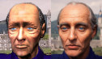
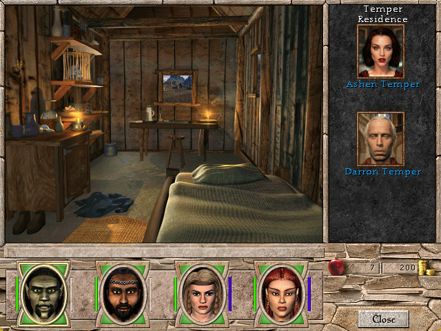
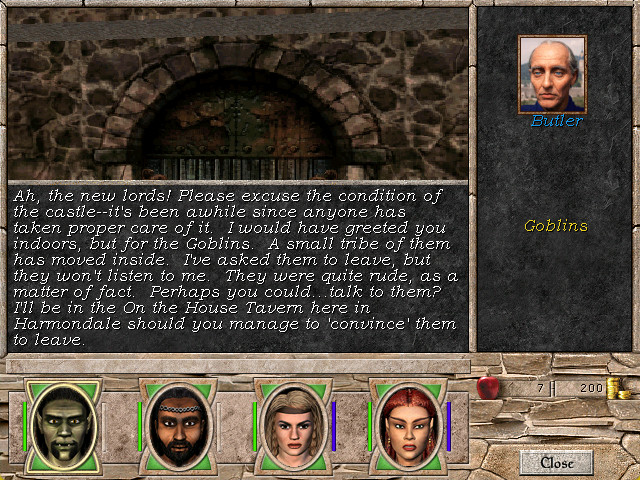

# mm7-portraits
Might &amp; Magic VII portraits repainted.

## Status

NPC: 159/584

## Goal

During development of Might and Magic VII the team switched to rendering portraits instead of using stock images, unlike in the previous installment.
That change is viewed negatively by some. The project aims at repainting the portraits to make them look more like real-life photos.

## How is it done

1. The original portrait is upscaled up to 512px.
2. Face restoration algorithm ([GFPGAN](https://github.com/TencentARC/GFPGAN)) is used to recover facial features.
3. Stable diffusion [model](https://civitai.com/models/372465/pony-realism) in img2img mode is used to repaint the image. CFG 7, denosing 0.4.
4. Overpaint missing details (optional).
5. Dim overly-bright pixels which will look wrong after game import (optional).

## Overview

